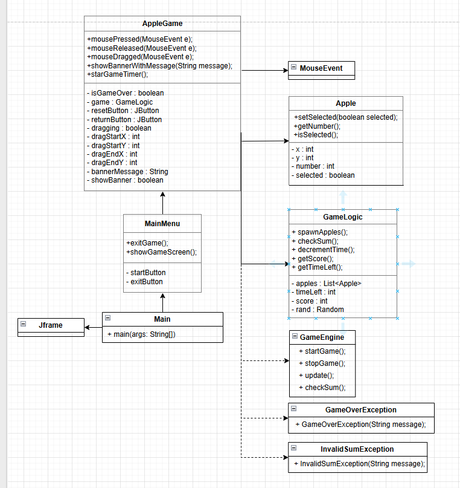
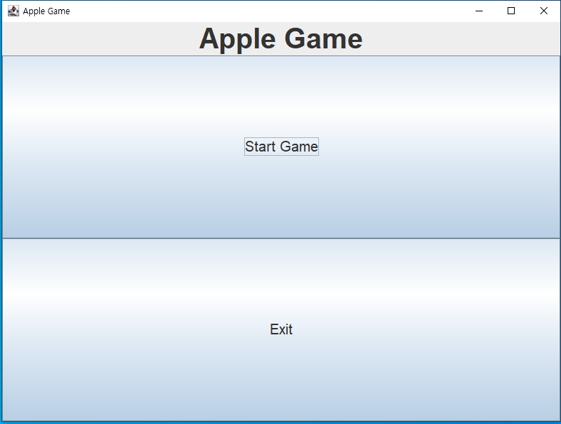
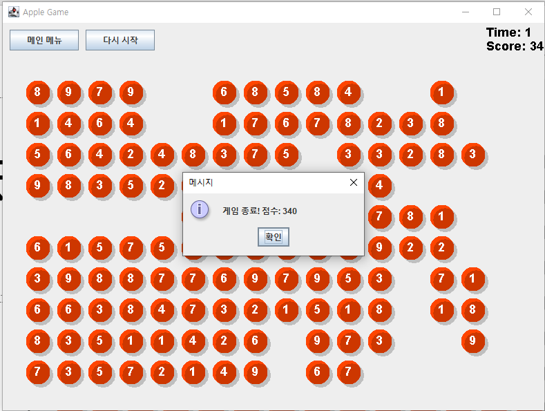

# 🍎AppleGame

간단한 자바 구현으로 만든 두뇌 퍼즐 게임 사과 게임입니다.  
숫자가 적힌 사과를 네모로 묶어 합이 10이 되도록 만드는 게임입니다.

---
## 📊 플로우 차트

---

## 🧠 게임 특징
- 간단한 규칙: 숫자 합만 맞추면 되기 때문에 누구나 쉽게 즐길 수 있습니다.

- 두뇌 훈련: 덧셈과 패턴 인식을 활용하여 집중력과 사고력을 향상시킵니다.

- 짧은 시간 플레이 가능: 틈날 때마다 부담 없이 즐길 수 있습니다.

---

## 🎮 게임 설명
- 화면에 숫자가 적힌 사과들이 있습니다. 

- 사과 여러 개를 드래그해서 사각형 영역으로 묶을 수 있습니다. 

- 그 영역 안의 숫자 합이 정확히 10이 되면 점수를 얻습니다.

- 제한 시간 안에 최대한 많은 "10"을 만들어 높은 점수를 획득하면 됩니다. 

---

## 📸 게임 화면

> 게임 메뉴 화면입니다.

> 인게임 화면 입니다.

> 게임 플레이 영상입니다.

> 제한시간이 다 되면 점수를 알려줍니다.
